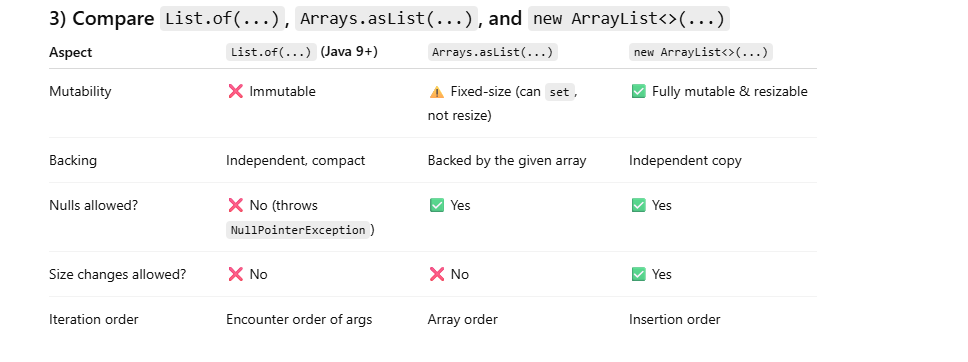

# ArrayList — Easy Interview Questions with Answers

---

### 1) What is the underlying data structure of ArrayList and how does it grow?
➡️ The underlying structure is an **array of objects (`Object[]`)**.  
When capacity is reached, `ArrayList` **grows by 1.5x** (old capacity + oldCapacity/2).

---

### 2) What’s the difference between `size()` and `capacity` of an ArrayList? How can you influence capacity?
- **size()** → number of elements actually stored in the list.
- **capacity** → length of the underlying array (`elementData`), i.e., how many elements it can hold before resizing.

You can influence capacity using:
- `new ArrayList<>(initialCapacity)` → sets initial capacity.
- `ensureCapacity(int minCapacity)` → ensures at least the given capacity.
- `trimToSize()` → shrinks internal array to fit the current `size()`.

---

### 3) Time complexity of `get(i)`, `add(e)`, `add(i, e)`, and `remove(i)`?
- `get(i)` → **O(1)** (direct index access).
- `add(e)` → **O(1) amortized** (resize may cost O(n), but rarely).
- `add(i, e)` → **O(n - i)** (shifts elements to the right).
- `remove(i)` → **O(n - i)** (shifts elements to the left).

---

### 4) Does ArrayList allow `null` elements? How are they treated by `contains` and `indexOf`?
✅ Yes, `ArrayList` **allows `null` values**.
- `contains(null)` → returns `true` if a `null` is present.
- `indexOf(null)` → returns the index of the first `null` element, or `-1` if not found.

---

### 5) What’s the difference between ArrayList and LinkedList in terms of access and insert/remove performance?
- **Access**:
    - `ArrayList` → **fast random access** (O(1) by index).
    - `LinkedList` → **sequential access only** (O(n) to traverse to index).

- **Insertion/Removal**:
    - `ArrayList` → inserting/removing in the middle requires **shifting elements** (O(n - i)).
    - `LinkedList` → insertion/removal itself is O(1), but **finding the node** takes O(n).

✅ So, `ArrayList` is better for access-heavy operations, while `LinkedList` is better for frequent insertions/removals **if you already have the node reference**.

# Medium (5)

# ArrayList — Medium Questions (Correct Answers)

## 6) Explain fail-fast behavior of ArrayList iterators. When do you get `ConcurrentModificationException` and how to remove safely while iterating?

**Fail-fast** iterators detect **structural modifications** to the list made outside the iterator (e.g., `add`, `remove`, `clear`) after the iterator is created.  
`ArrayList` maintains a `modCount`; each iterator stores an `expectedModCount`. On each iterator operation, if `modCount != expectedModCount`, it throws **`ConcurrentModificationException`** (best-effort bug detection; not a correctness guarantee).

**Safe modifications while iterating**
- Use the iterator’s own methods:
    - `Iterator.remove()` — remove the last returned element.
    - `ListIterator.add(E)` / `ListIterator.remove()` / `ListIterator.set(E)` — richer edits.
- Or iterate over a **copy** (e.g., `for (E e : new ArrayList<>(list))`).

**Example (safe removal):**
```java
Iterator<Integer> it = list.iterator();
while (it.hasNext()) {
  if (it.next() % 2 == 0) it.remove();
}
```
## 7) What does ensureCapacity(int) and trimToSize() do? When would you call them?

    ensureCapacity(int minCapacity): Ensures the internal array can hold at least minCapacity. If current capacity < minCapacity, it grows (typically by 1.5×) to avoid repeated resizes.
    
    Use when you know you will add many elements soon (performance optimization).
    
    trimToSize(): Shrinks the internal array capacity down to the current size to free memory.
    
    Use when the list will not grow further (memory optimization).

## 8) What’s returned by toArray() vs toArray(T[] a)? Show how to get a String[] from an ArrayList<String>.

    toArray() → returns Object[].
    
    toArray(T[] a) → returns a typed array (T[]). If a is too small, a new array of the same runtime type is created and returned.
    
    Idiomatic conversions:
    
    List<String> list = List.of("a", "b");
    
    // Preferred idiom:
    String[] arr1 = list.toArray(new String[0]);
    
    // Also valid:
    String[] arr2 = list.toArray(new String[list.size()]);

## 9) What are the semantics of subList(from, to)? Is it a copy or a view? What pitfalls can arise when modifying the parent list or sublist?

    subList(from, to) returns a view, not a copy.
    
    Backed by the original list: changes in one reflect in the other (for the subrange).
    
    Pitfalls:
    
    Structural changes to the parent list outside the subList (or vice versa) will usually cause ConcurrentModificationException on subsequent operations/iteration of either.
    
    Many developers assume it’s an independent list; it’s not.
    
    If you need an independent list: new ArrayList<>(list.subList(from, to)).

## 10) Why is ArrayList not thread-safe? Show two safe alternatives for multi-threaded reads/writes.

    ArrayList methods are not synchronized; concurrent structural modifications can corrupt internal state (e.g., inconsistent size vs elementData) or cause visibility issues.
    
    Safe alternatives:
    
    Synchronized wrapper:
    
    List<E> syncList = Collections.synchronizedList(new ArrayList<>());
    // Remember to synchronize during iteration:
    synchronized (syncList) {
    for (E e : syncList) { /* ... */ }
    }
    
    
    CopyOnWriteArrayList (good for many reads, few writes):
    
    List<E> cow = new CopyOnWriteArrayList<>();
# ArrayList — Hard Questions (Answers)

## 1) Amortized insertion cost: why is appending `O(1)` on average?

`ArrayList` stores elements in an internal `Object[]`. When it fills up, it grows the array by ~**1.5×** (old + old/2) and copies elements into the new array.

- **Cost model:** Most `add(e)` calls just write to a free slot → **O(1)**.
- **Occasional resize:** When capacity is exceeded, a resize does a **bulk copy** of `k` elements → **O(k)** once in a while.

Because capacity grows **geometrically**, the number of resizes for `n` appends is `O(log n)`, and the **total number of elements copied** across all resizes forms a **geometric series** bounded by `O(n)`. Therefore, the **average cost per append** is:

> (total copying work `O(n)`) / (n appends) = **O(1) amortized**

So appending remains **O(1) amortized**, even though a single append may occasionally be **O(n)** when it triggers a resize.

---

## 2) What happens in this loop and why? Two safe ways to remove evens.

```java
var list = new ArrayList<>(List.of(1, 2, 3, 4, 5));
for (Integer x : list) {
    if (x % 2 == 0) list.remove(x);
}
****urally modify the original list after taking a subList and then interact with the sublist iterator?

What happens?

The enhanced for uses an iterator under the hood.

Calling list.remove(x) performs a structural modification on the list outside the iterator.

The iterator’s expectedModCount no longer matches the list’s modCount ⇒ ConcurrentModificationException.

Two correct ways

A) Use the iterator’s remove()

Iterator<Integer> it = list.iterator();
while (it.hasNext()) {
    if (it.next() % 2 == 0) it.remove();
}


B) Use removeIf (Java 8+)

list.removeIf(x -> x % 2 == 0);


(Other valid approaches: collect to a new list via stream().filter(...), or use ListIterator and its mutation methods.)
```

3) Compare List.of(...), Arrays.asList(...), and new ArrayList<>(...)

4) How does modCount drive fail-fast, and why is it “best effort”?

            ArrayList maintains a modCount: increments on structural changes (add, remove, clear).
            
            Each iterator saves a snapshot as expectedModCount.
            
            On next() / remove() calls, if modCount != expectedModCount → ConcurrentModificationException.
            
            Why best effort?
            
            Not synchronized → in races, some modifications may slip by undetected.
            
            Fail-fast is a bug detector, not a correctness guarantee.
            
            The Javadoc explicitly says: “fail-fast iterators… throw ConcurrentModificationException… but this behavior cannot be guaranteed.”

5) Deep dive: subList + sorting

Code:
        
        Collections.sort(list.subList(2, 8));
        
        
        subList(2, 8) returns a view of the original list, not a copy.
        
        Sorting reorders elements in indices [2..7] of the original list.
        
        Other indices remain unchanged.
        
        Safe because sorting uses set() calls, not structural modifications.

6) What happens if you structurally modify the parent list after taking a subList?

        subList is backed by the parent list, sharing its internal modCount.
        
        Structural modifications (like add, remove, clear) on the parent list outside the subList’s range cause modCount mismatch.
        
        Result → future calls on either parent or subList throw ConcurrentModificationException.
        
        Safe practice:
        
        If you need an independent sublist:
        
        List<E> copy = new ArrayList<>(list.subList(from, to));
        
        
        Otherwise, make all structural changes consistently through the subList or the parent, but not both.